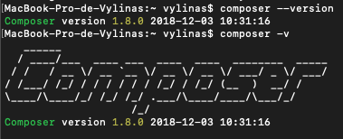
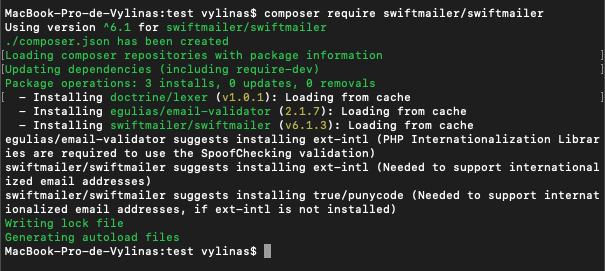
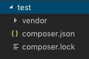
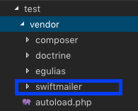
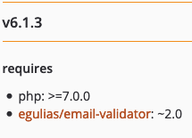
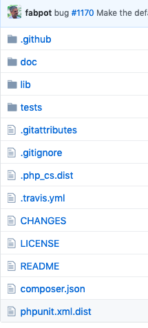
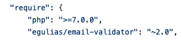

# Composer

Composer est un gestionnaire de paquets qui gère les dépendances d'un projet.

Commençons à décrypter çà.

## Qu'est-ce qu'un paquet ?

Imaginons que l'on ait besoin de manipuler un fichier .csv/.exel pour l'importer dans une base de données ou vice versa.

Vous avez deux possibilités, vous pouvez créer de A-Z le système de lecture de fichiers, de traitement de données, ect. mais cela prend du temps ou vous pouvez récupérer un paquet déjà codé, il ne restera plus qu'à l'intégrer au projet (utiliser ses fonctions, adapter le code, etc).

## Où puis-je trouver ces paquets ?

Il existe dans le monde différents servers où sont stokés ces paquets, ils sont généralement regroupés par techno (js, php, java, ect).

Composer sert à récupérer des paquets PHP, on peut les trouver [ici](https://packagist.org/explore/).

Ils sont créés par des développeurs qui mettent à disposition leurs travaux pour facilité le travail de tout le monde.

## Bon les paquets c'est compris mais pourquoi un gestionnaire ?

Une fois installé, chaque gestionnaire dispose d'un [CLI](https://fr.wikipedia.org/wiki/Interface_en_ligne_de_commande) qui permet de télécharger ces packets simplement et de les installer proprement dans notre projet.

Il en existe d'autres comme npm, yarn pour JS.

On peut citer aussi apt-get sur Linux Ubuntu, Homebrew pour mac et Chocolatey pour Windows.

Composer va nous permettre de récupérer des paquets PHP.

## Let's GO! Comment je l'installe ?

**Les commandes que vous trouverez par la suite sont à rentrer dans votre terminal** 

### Linux Ubuntu :

*Si besoin, pensez à mettre à jour votre apt avec cette ligne avant de lancer l'installation de Composer*

```
sudo apt-get update
```
Pour l'installation de Composer :

```
sudo apt-get install composer
```
--

### Windows

Pour Windows, les chanceux ont un .exe qui automatise le tout. 

[Ici pour un petit tuto](http://webdevzoom.com/how-to-install-composer-on-windows/).

--

### Mac

Sur Mac, je vous conseille de l'installer avec Homebrew qui simplifira la tâche.

Il vous faut XCode à télécharger dans l'apple-store.

Puis [ici pour installer Homebrew](https://brew.sh/index_fr)

Enfin installer Composer avec :

```
brew install composer
```
--

#### Petite vérifiction pour tout le monde

Pour vérifier que vous ayez bien installé Composer, vous pouvez le tester en lui demandant sa version comme ça :

```
composer --version
```

Ou en abréger :

```
composer -v
```

Voici ce que vous devriez avoir :



## C'est bon je l'ai ! Maintenant comment je m'en sert ?

La syntaxe :

```
composer require [le_nom_de_la_lib]
```

En français : 

```
composer -  j'ai besion de - [le_nom_de_la_lib]
```


Cette ligne téléchargera automatiquement la librairie demandée.

Essayons d'intaller [SwiftMailer](https://packagist.org/packages/swiftmailer/swiftmailer) pour tester ça. SwiftMailer est un gestionnaire de Mail pour php.

Créer un dossier "test/" n'importe où et placez vous dedans avec le terminal, comme ceci : 


Puis entrez cette ligne :

```
composer require swiftmailer/swiftmailer
```

Le téléchargement s'oppère : 



Si vous regardez dans votre "test/", vous trouverez deux fichiers et un dossier :



Un "composer.lock", "composer.json" et un dossier "vendor/".


## Explications

#### Vendor

C'est le dossier qui contiendra toutes les librairies installées par Composer. Si vous l'ouvrez, vous trouverez votre dossier nommé "swiftmailer".



#### composer.json

Ce fichier contient vos dépendances, celles que vous installez.

Il faut comprendre, par dépendances, que votre projet a besoin de ce paquet pour son bon fonctionnement. Il dépend de celui-ci pour marcher.

#### composer.lock

Il contient les dépendances héritées de celles que vous installez.

Vous pouvez les tracer depuis [Packagist](https://packagist.org/packages/swiftmailer/swiftmailer).

En bas de la page, en dessous de sa version, vous pouvez voir une section. On y trouve une colonne "requires". Ceux sont les dépendances du paquet lui-même.



Donc SwiftMailer a besoin de "php: >=7.0.0" et d'un autre paquet nommé "egulias/email-validator", qui lui-même a besoin
de "php: >= 5.5" et "doctrine/lexer" ect, ect.

**Attention :**

On ne touche pas au dossier "vendor", les fichiers doivent rester tel quel.

**Pourquoi ?**

Lorsque vous récuperez un projet, depuis Github par exemple, on ne stock pas directement le contenu de "vendor" (trop volumineux).

Allons voir SwiftMailer sur Github pour voir comment c'est gérer, [ici](https://github.com/swiftmailer/swiftmailer).



Sur le dépôt, on trouve le "composer.json", si vous l'ouvrez, vous trouverez les fameuses dépendances :



On ne trouve pas de "vendor", c'est normal.

Donc si vous récuperez SwiftMailer depuis Github, c'est à vous d'installer ses dépendances grâce à :

```
composer install
```
*Toujours dans le terminal*


- Si il existe, sur cette commande, Composer va rechercher un fichier "composer.json" et récupérer ses dépendances (en créant le "vendor" et le "composer.lock" par la même occasion).

- Si "composer.json" n'existe pas, il le créera et le mettra à jour sur votre prochaine installation de paquet (dans le cas d'un nouveau projet par exemple).


### Voila! Vous êtes prêt pour Composer et ses amis !